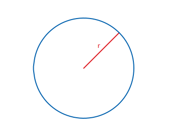
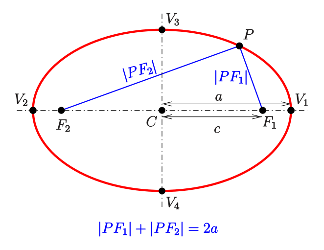
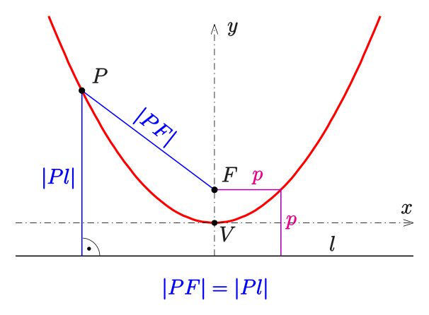
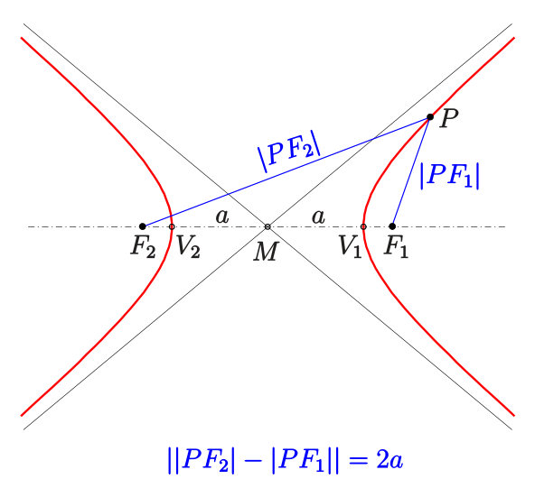
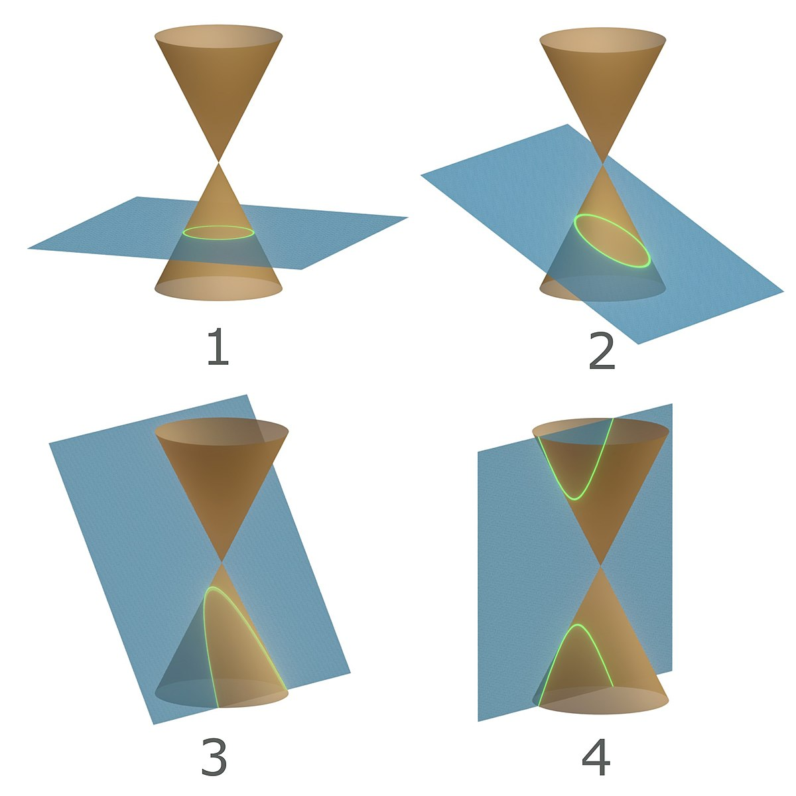
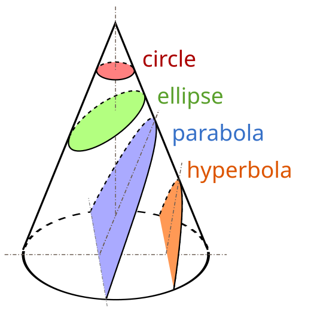
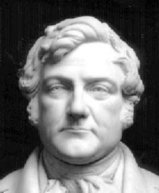
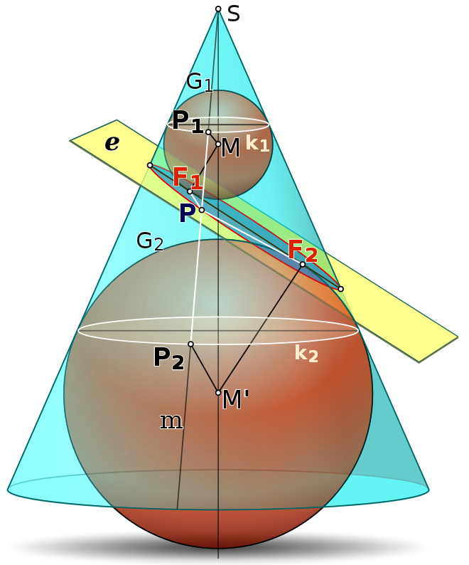
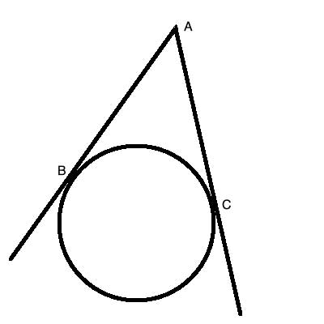

class: title

.content[
# Conic Sections

## Joy of ~~Science~~ Math 2024
## Darren Kessner

       
       
 

  

###   
###   
### &nbsp;  Ellison Medical Institute   

]

---

layout:true

class: normal

.footer[
Ellison Medical Institute 
]

---

class: normal

# Geometry

.row[

.column[
.left[circle]

.left[ellipse]

]

.column[
.left[parabola]

.left[hyperbola]

]

]

---

class: normal

# Conic Sections

.row[
.column[
  

]

.column[
  

]

]

---

class: normal

# Dandelin Spheres

.row[
.column[

Germinal Pierre Dandelin  
12 April 1794 – 15 February 1847  

French mathematician, soldier, and professor of engineering  
]

.column[

]

]

---

class: normal

# Demo

.row[
.column[

]

.column[

Observations:  

- Intersection of cone and sphere is a circle

- The cone is tangent to the sphere at the points of contact

- Two spheres determine the angle of the plane that is tangent to both

- Two tangent theorem:

.center[

]

.center[
<a href="https://dkessner.github.io/Explorations/dandelin/" target="_blank">
Interactive demo</a>
]

]

]

